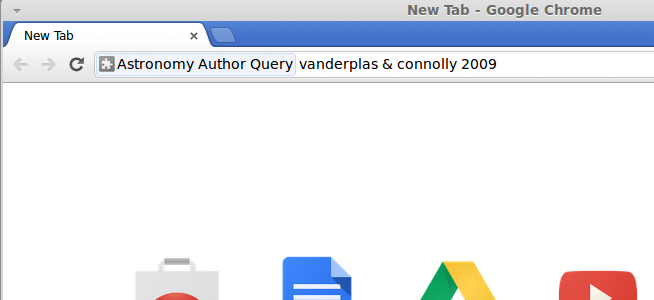
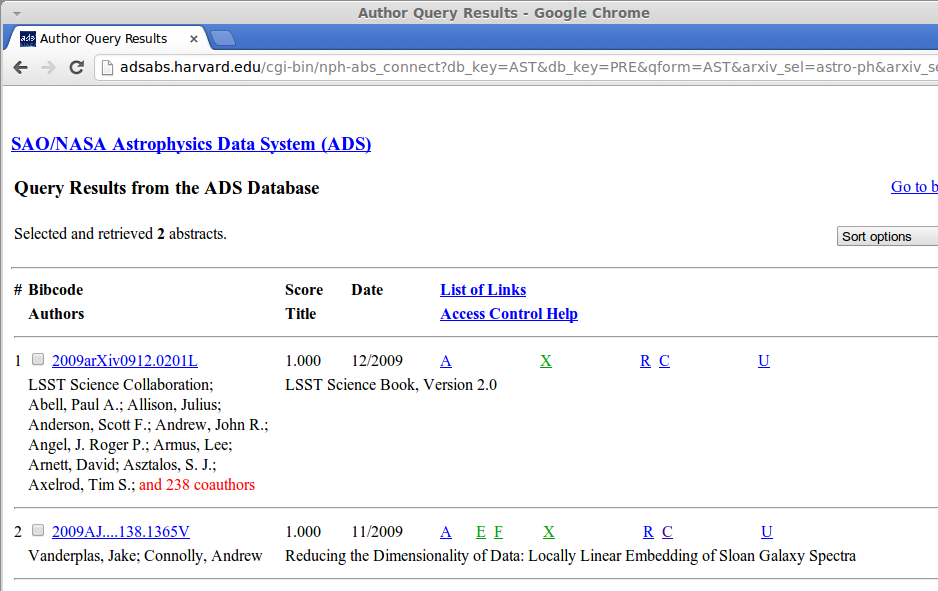

AstroAuthorQuery
================

A simple chrome extension to do quick ADS author queries from the Chrome
Omnibox.

To load this extension, clone this repository, and make sure you have
installed [Google Chrome](https://www.google.com/intl/en/chrome/browser/).
Open the Chrome browser, and type in the address bar (which Chrome calls
the "omnibox"):
```
chrome://extensions
```
Click the check-box next to "developer mode", click "load unpacked extension",
and navigate to the ``AstroAuthorQuery`` directory containing the
``manifest.json`` file.

Once this extension is loaded, you can type "ADS" in the omnibox, followed
by an author query.




Examples
--------

- ``ADS ^Einstein 1906-1910``: Search for papers with the first author "Einstein", published from 1906 to 1910.

- ``ADS vanderplas & connolly 2009: Search for papers written by vanderplas & connolly (and perhaps other authors) in the year 2009

- ``ADS ^vanderplas and connolly 2011: Search for papers written by vanderplas & connolly (and perhaps other authors) with vanderplas as the first author, published in the year 2011

Issues
------
My javascript text parsing skills are pretty minimal, so nothing much more
complicated than this is implemented currently.  If you have ideas for how
to improve this, please let me know!
